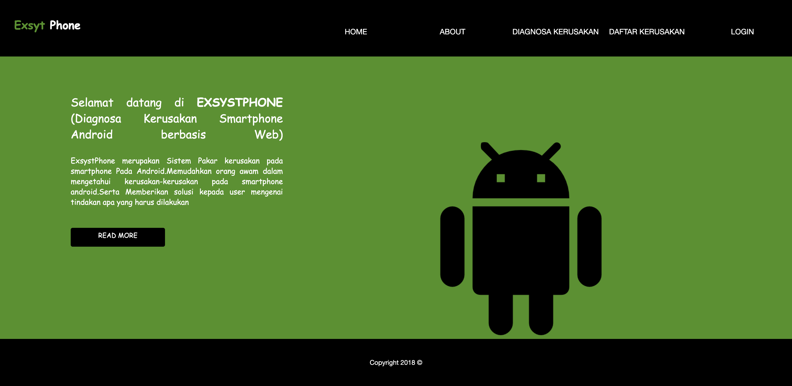

# Sistem Pakar
 
Sistem Pakar Diagnosa Kerusakan Smartphone Android menggunakan metode forward chaining
  

>MVVM diagram made by yours truly

## How to  instsall

* Download / clone this repository
* move sistempakar folder to htdocs
* Import db_sbp.sql to phymyadmin
* Run the program on the browser
  
## Screenshot

